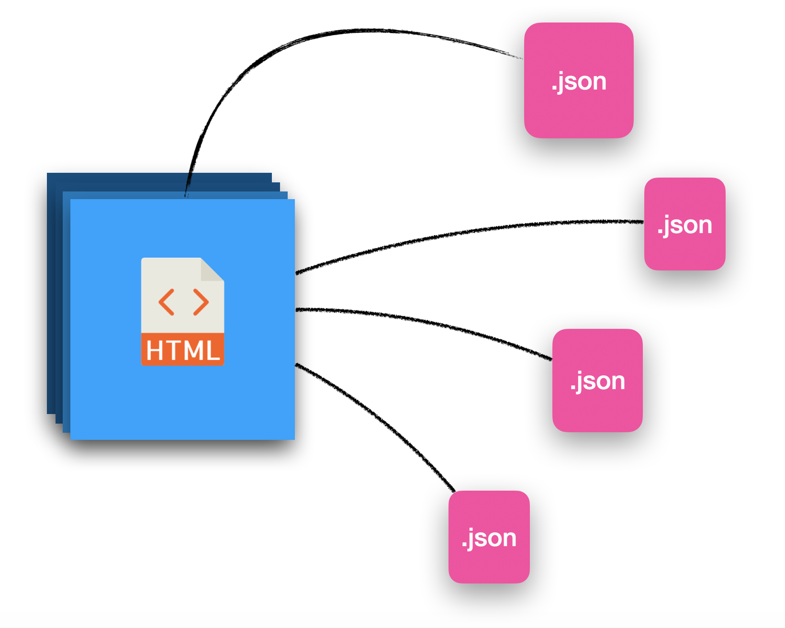

# **text2locale**

Extract all the texts of any project with HTML files and generate a KV (Key-Value) file,
`key` = reference key, `value` = extracted text.

## Install

```bash
npm install @juliandavidmr/text2locale
```

## Usage

```bash
text2locale input "./example/src" -o "./example/locale/" -l en -t es,de,zh
```

> More command info: `$ text2locale input --help`

## API

### `input` command options

| Option              | Description                            | Default |
|---------------------|----------------------------------------|---------|
| `-l`, `--lang`      | Language of the texts to be extracted. | `en`    |
| `-o`, `--output`    | Output directory.                      | `./`    |
| `-s`, `--separator` | Separator to generate the key names.   | `_`     |
| `-t`, `--templates` | Generate template for other languages. | `en,es` |

--------

## Whats Next?

The generated files can be manipulated by the [i18n-editor](https://juliandavidmr.github.io/i18n-editor/dist/#/layout) website, you can add/remove/edit all translation resources from multiple JSON files at the time.

## License

[MIT](./LICENSE)
